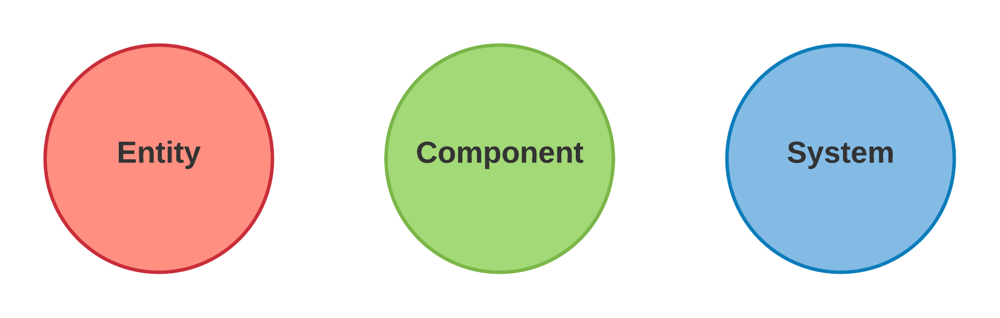
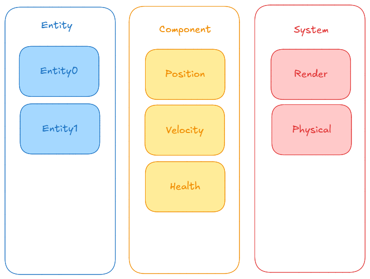
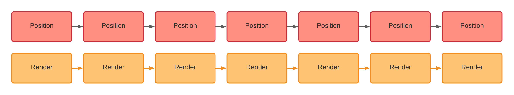
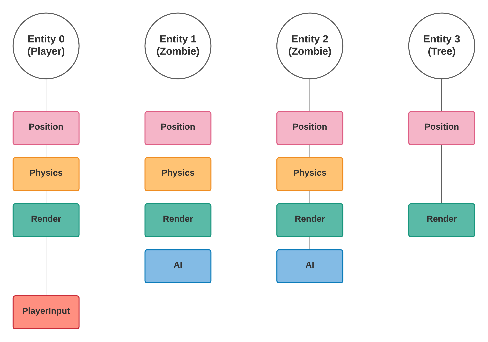

[TOC]

## 📌 ECS 实体组件系统（Entity-Component-System）

实体组件系统（ECS）是一种**数据驱动的架构**，广泛用于**游戏开发**和**高性能应用**。它与传统的**面向对象编程（OOP）**不同，能够更高效地管理游戏对象（实体）并利用**CPU 缓存优化**程序性能。

### 🔹 1. ECS 的三个核心部分

ECS 由 **实体（Entity）**、**组件（Component）** 和 **系统（System）** 组成：



#### **1️⃣ 实体（Entity）**

- **实体**是世界中的一个对象。在使用 ECS 的程序中，实体只是一个**唯一的整数 ID**，它本身不包含任何数据或功能，纯粹是一个标识符。实体将组件与系统连接起来。

#### **2️⃣ 组件（Component）**

- **组件**是包含数据的容器，代表实体的某一属性或状态。例如：位置（Position）、速度（Velocity）、生命值（Health）等。组件通常不包含任何功能或逻辑，只有数据。多个组件可以附加到同一个实体，定义该实体的不同方面。

#### **3️⃣ 系统（System）**

- **系统**是执行游戏逻辑的地方，它们操作与实体相关联的组件。每个系统都专注于处理特定类型的组件，如渲染、物理计算或AI。系统每帧运行一次，遍历符合特定条件的实体并修改其组件数据。

### 🔹 2. ECS 与传统面向对象编程（OOP）的对比

#### 🔸 **在面向对象编程中**

面向对象编程通常通过继承和类的组合来组织代码。比如，我们可能会有一个 `GameObject` 父类，继承此类的对象会包含共享的数据和行为。


#### 🔸 **在 ECS 中**

ECS 不使用继承，而是将数据和功能分离。数据存储在 **组件（Component）** 中，功能则由 **系统（System）** 提供。每个实体（Entity）只是一个 ID，它与组件数据一起存储并由系统处理。



#### 🔸 **总结**

ECS 提供了一种不同于传统面向对象编程的架构。它通过分离数据（组件）和行为（系统），在确保代码清晰的同时，还能优化性能。ECS 尤其适用于大规模的游戏开发中，**特别是在需要频繁更新大量实体的场景下**。

|              | OOP（面向对象编程） | ECS（实体组件系统）  |
| ------------ | ------------------- | -------------------- |
| **数据存储** | 分散（对象存储）    | 紧凑（组件数组）     |
| **扩展性**   | 继承关系复杂        | 组件自由组合         |
| **性能**     | CPU 缓存不优化      | CPU 缓存优化         |
| **耦合度**   | 高（类继承）        | 低（数据和行为解耦） |
| **适用场景** | 小型应用            | 大型、高性能系统     |

### 🔹 3. ECS 高级特性

#### 1️⃣ 组件数组（Component Arrays）

组件数据通常存储在数组中，组件类型会有一个单独的数组，每个实例按顺序存储，内存是连续的，优化 CPU 缓存。



#### 2️⃣ 系统过滤（Systems Filtering）

系统通过过滤条件选择需要更新的实体。比如，物理系统只会更新具有 `Position` 和 `Velocity` 组件的实体，如下图所示，即物理系统只会选择实体 `Player` `Entity1 Zombie` `Entity2 Zombie` 进行更新。



#### 3️⃣ 事件系统

系统可以通过事件机制进行通信。例如，当健康组件更新时，可以触发一次伤害事件。

## 📌`entt`库简单示例

📌 **`entt` 是一个轻量级且高效的 ECS 库，非常适合游戏引擎开发！** 🚀

### 🔹 1. 基础：创建实体

```cpp
#include <iostream>
#include <entt/entt.hpp>

int main() 
{
    entt::registry registry;  // 创建一个实体注册表

    // 创建实体
    entt::entity entity1 = registry.create();
    entt::entity entity2 = registry.create();

    std::cout << "Entity 1 ID: " << (uint32_t)entity1 << std::endl;
    std::cout << "Entity 2 ID: " << (uint32_t)entity2 << std::endl;

    return 0;
}
```

🔹 `entt::registry` 是 `entt` 的核心数据管理器，**用于创建和管理实体**。

### 🔹 2. 添加和移除组件

 ```cpp
 #include <iostream>
 #include <entt/entt.hpp>
 
 struct Position { float x, y; }; // 位置组件
 struct Velocity { float dx, dy; }; // 速度组件
 
 int main() 
 {
     entt::registry registry;
     entt::entity entity = registry.create();
 
     // 向实体添加组件
     registry.emplace<Position>(entity, 10.0f, 20.0f);
     registry.emplace<Velocity>(entity, 1.0f, 1.5f);
 
     // 获取组件数据
     auto& pos = registry.get<Position>(entity);
     std::cout << "Position: (" << pos.x << ", " << pos.y << ")\n";
 
     // 移除组件
     registry.remove<Velocity>(entity);
     return 0;
 }
 ```

🔹 `emplace<T>(entity, 参数...)` **添加组件**
🔹 `get<T>(entity)` **获取组件**
🔹 `remove<T>(entity)` **移除组件**

### 🔹 3. 遍历实体

```cpp
#include <iostream>
#include <entt/entt.hpp>

struct Position { float x, y; };
struct Velocity { float dx, dy; };

int main()
{
    entt::registry registry;

    // 创建多个实体并添加组件
    for (int i = 0; i < 5; i++) 
    {
        auto entity = registry.create();
        registry.emplace<Position>(entity, i * 10.0f, i * 5.0f);
        if (i % 2 == 0) {
            registry.emplace<Velocity>(entity, 1.0f, 1.0f); // 偶数索引实体加速度组件
        }
    }

    // 遍历所有有 Position 组件的实体
    auto view = registry.view<Position>();
    for (auto entity : view)
    {
        auto& pos = view.get<Position>(entity);
        std::cout << "Entity " << (uint32_t)entity << " Position: (" << pos.x << ", " << pos.y << ")\n";
    }

    return 0;
}
```

🔹 `view<T>()` 创建视图，**只遍历拥有 `T` 组件的实体**。
🔹 `view.get<T>(entity)` **获取该组件的数据**。

### 🔹 4. `group<>` 组遍历（多个组件）

```cpp
#include <iostream>
#include <entt/entt.hpp>

struct Position { float x, y; };
struct Velocity { float dx, dy; };

int main() 
{
    entt::registry registry;

    for (int i = 0; i < 5; i++)
    {
        auto entity = registry.create();
        registry.emplace<Position>(entity, i * 10.0f, i * 5.0f);
        registry.emplace<Velocity>(entity, 1.0f, 1.5f);
    }

    // 遍历所有拥有 Position 和 Velocity 的实体
    auto group = registry.group<Position>(entt::get<Velocity>);

    for (auto entity : group)
    {
        auto& [pos, vel] = group.get<Position, Velocity>(entity);
        pos.x += vel.dx;
        pos.y += vel.dy;

        std::cout << "Entity " << (uint32_t)entity << " New Position: (" << pos.x << ", " << pos.y << ")\n";
    }

    return 0;
}
```

🔹 `group<A>(entt::get<B>())` 遍历 **同时拥有 `A` 和 `B` 组件的实体**。
🔹 `group.get<A, B>(entity)` **获取多个组件的引用**。

### 🔹 5. 监听组件添加/移除事件

```cpp
#include <iostream>
#include <entt/entt.hpp>

struct Position { float x, y; };

void OnPositionAdded(entt::registry& registry, entt::entity entity) 
{
    auto& pos = registry.get<Position>(entity);
    std::cout << "Entity " << (uint32_t)entity << " added Position: (" << pos.x << ", " << pos.y << ")\n";
}

int main() 
{
    entt::registry registry;

    // 监听组件创建事件
    registry.on_construct<Position>().connect<&OnPositionAdded>();

    // 创建实体并添加 Position 组件，会自动触发 OnPositionAdded
    auto entity = registry.create();
    registry.emplace<Position>(entity, 15.0f, 30.0f);

    return 0;
}

```

🔹 `on_construct<T>().connect<&Function>` 监听 **组件添加事件**。
🔹 `on_destroy<T>().connect<&Function>` 监听 **组件移除事件**。
🔹 `on_update<T>().connect<&Function>` 监听 **组件修改事件**。
🔹 `on_construct() / on_destroy() / on_update()` （全局监听）监听整个注册表中的所有组件。

